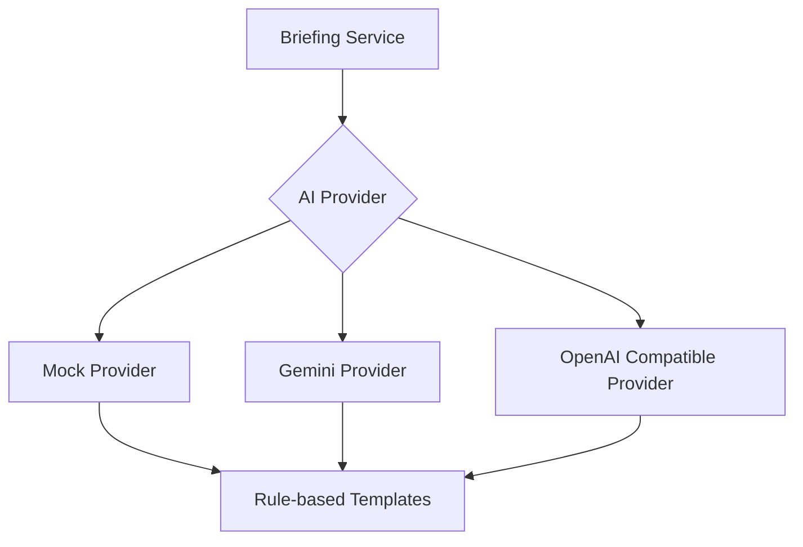
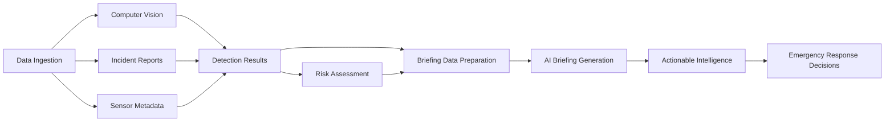

# AI Pipeline in ResQLink

## Overview

ResQLink incorporates multiple AI components to process disaster-related data and generate actionable intelligence for emergency responders. This document describes the AI pipeline architecture, including computer vision, risk assessment, and natural language generation components.

## Computer Vision Pipeline

### Object Detection with YOLOv8

The computer vision component uses Ultralytics YOLOv8 (You Only Look Once, version 8) for real-time object detection in imagery from drones, CCTV, and other sources.

#### Pipeline Steps:
1. **Input Acquisition**: Images or video frames from various sources (uploaded files, camera streams, etc.)
2. **Preprocessing**: 
   - Resizing to model input dimensions (640x640 for YOLOv8n)
   - Color space conversion (BGR to RGB)
   - Normalization (pixel values scaled to 0-1 range)
3. **Inference**: YOLOv8 model processes the input to detect objects
4. **Postprocessing**:
   - Non-maximum suppression to eliminate duplicate detections
   - Confidence threshold filtering
   - Class mapping to human-readable labels
5. **Geolocation Association**: When available, metadata from the source (GPS coordinates, timestamps) is attached to detections
6. **Result Formatting**: Detections are formatted into a standardized JSON structure

#### Supported Classes:
While the base YOLOv8n model is trained on COCO dataset classes, ResQLink focuses on disaster-relevant detections:
- **person**: Survivors, victims, responders
- **car, truck, bus, motorcycle**: Vehicles (potentially damaged or used for transport)
- **boat**: Water vessels (for flood scenarios)
- **bird, cat, dog, horse, sheep, cow, elephant, bear, zebra, giraffe**: Animals (may indicate presence of people or hazards)

Note: The base model does not include disaster-specific classes like "fire", "collapsed building", or "flood". For these, ResQLink uses:
1. **Proxy Detection**: Using related classes (e.g., "fire" is approximated by detecting smoke or heat signatures when available)
2. **Custom Training**: In future iterations, the model can be retrained on disaster-specific datasets
3. **Rule-based Interpretation**: Combining multiple detections to infer hazards (e.g., multiple "person" detections in a collapsed structure area)

### Model Architecture
```
Input Image → [Preprocessing] → [YOLOv8 Backbone] → [Feature Pyramid Network] → 
[Detection Heads] → [Postprocessing] → [Filtered Detections] → [Geo-tagging] → [Output]
```

### Performance Considerations
- **Accuracy vs Speed**: YOLOv8n provides a good balance for real-time applications
- **Hardware Acceleration**: Can utilize GPU when available for faster inference
- **Batching**: Multiple frames can be processed in parallel for video streams

## Risk Assessment Pipeline

### Factors Considered
The risk calculation service evaluates multiple factors to determine the severity level of geographic zones:

1. **Survivor Factor**: Number of detected survivors (weighted by confidence)
2. **Fire Factor**: Number of active fire detections
3. **Damage Factor**: Structural damage indicators from reports and detections
4. **Report Factor**: Number and credibility of field reports
5. **Population Factor**: Estimated population density in the zone
6. **Accessibility Factor**: Ease of access for rescue teams (inverse - poorer accessibility increases risk)
7. **Recency Factor**: How recent the data is (newer data decreases risk due to better situational awareness)

### Calculation Method
Each factor is normalized to a 0-30 point scale (with different maxima per factor) and then weighted according to configuration:

```
Risk Score = Σ(Factor Value × Factor Weight)
```

Where:
- Factor Values are normalized contributions (0-max points)
- Factor Weights sum to 1.0

### Severity Classification
Scores are mapped to severity levels:
- 0-20: SAFE
- 21-40: LOW
- 41-60: MEDIUM
- 61-80: HIGH
- 81-100: CRITICAL

### Explanation Generation
The system provides human-readable explanations by:
1. Identifying the top contributing factors
2. Calculating each factor's percentage contribution to the total score
3. Generating a recommended action based on the severity level

## Natural Language Generation Pipeline

### Briefing Creation
The AI briefing generation system synthesizes data from multiple sources into a coherent situation report.

#### Input Data:
- Computer vision detections (aggregated by zone and type)
- Incident reports (from citizens, responders, drones, etc.)
- Zone risk assessments
- Resource availability and deployment status
- Mesh network connectivity status
- Temporal information (timestamps, update frequency)

#### Processing Steps:
1. **Data Aggregation**: 
   - Group detections by class and location
   - Summarize reports by severity and type
   - Calculate zone-level statistics
2. **Importance Ranking**: 
   - Identify critical zones (high risk scores)
   - Flag high-priority reports (CRITICAL severity, high confidence)
   - Note significant changes from previous updates
3. **Template Population**: 
   - Fill in predefined briefing sections with aggregated data
   - Generate narrative summaries using rule-based templates
4. **Language Polishing**: 
   - Ensure consistent terminology
   - Format numbers and units properly
   - Add transitional phrases for readability

#### Output Sections:
1. Situation Summary
2. Critical Incidents
3. Highest Risk Zones
4. Survivor Status
5. Fire/Structural Hazards
6. Resource Requirements
7. Recommended Actions
8. Communication Status

### AI Provider Abstraction
ResQLink uses a provider-agnostic approach to allow flexibility in AI backends:



#### Provider Types:
1. **Mock Provider**: Returns template-based briefings for development and when API keys are unavailable
2. **Gemini Provider**: Uses Google's Gemini models for generation
3. **OpenAI Compatible Provider**: Works with OpenAI's GPT models or compatible APIs

### Confidence and Attribution
All AI-generated content is clearly labeled as decision support:
- Briefings include a disclaimer that they are AI-generated
- Confidence indicators are provided where applicable
- Human review is required before taking action on AI recommendations

## Data Flow Through the AI Pipeline



## Integration Points

### With Frontend
- Vision detections update map markers and detection lists
- Risk scores drive zone coloring and priority indicators
- Briefings populate the AI Briefing page
- Mesh status affects communication icons

### With Backend Services
- Vision service provides detection API endpoints
- Risk service offers calculation endpoints
- Briefing service handles generation requests
- All services can operate with mock implementations when external dependencies are unavailable

## Limitations and Assumptions

### Computer Vision
- Base YOLOv8 model cannot reliably detect disaster-specific classes without retraining
- Performance varies with image quality, lighting, and occlusion
- Small or distant objects may be missed
- False positives can occur in complex scenes

### Risk Assessment
- Weights are currently hardcoded (configurable via environment variables in production)
- Does not dynamically adjust weights based on disaster type
- Assumes linear relationships between factors and risk
- Limited historical data for model training

### Natural Language Generation
- Mock provider uses fixed templates
- Real providers depend on API availability and costs
- Generated briefings may miss nuanced context that human experts would catch
- Length and detail level are not dynamically adjusted to audience needs

### Overall
- AI components are designed as decision aids, not autonomous decision makers
- All outputs should be reviewed by trained emergency personnel
- System degrades gracefully when AI components are unavailable (using mock/simulated data)

## Future Enhancements

1. **Disaster-Specific Models**: Retrain YOLOv8 on datasets containing disaster-relevant classes
2. **Temporal Analysis**: Track changes over time to predict evolving situations
3. **Multi-modal Fusion**: Combine satellite imagery, social media, and sensor data
4. **Uncertainty Quantification**: Provide confidence intervals for AI predictions
5. **Active Learning**: Improve models based on field feedback and corrections
6. **Explainable AI**: Show which specific detections contributed to risk scores and briefing content

## Conclusion

The AI pipeline in ResQLink provides a demonstrative framework for how artificial intelligence can enhance disaster response operations. While the current implementation uses simplified models and rule-based approaches where necessary, it establishes the architectural patterns and data flows that would be used in a more sophisticated production system. The modular design allows individual components to be upgraded as better models and data become available.